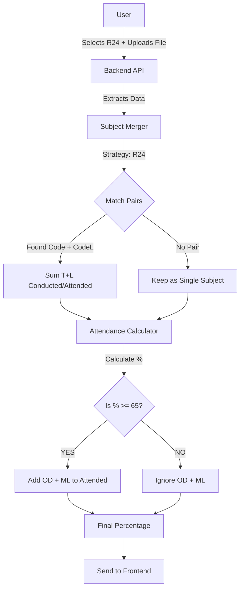

# 🔄 Complete System Workflow

This document explains exactly how the **Faculty Proforma System** processes attendance data, step-by-step.

---

## 🏗️ 1. The Interaction (Frontend)

The process starts when a faculty member visits the website.

1.  **Regulation Selection**: The user selects either **U18** or **R24**.
    *   *Why?* different regulations have different ways of naming their Theory vs. Lab subjects.
2.  **File Upload**: The user uploads the Excel file.
3.  **API Call**: The system sends the file + the selected regulation to the backend.
    *   `POST /api/analyze?regulation=R24`

---

## ⚙️ 2. The Core Logic (Backend)

Once the backend receives the data, it follows a strict **3-Step Process**:

### **Step A: Identification (Subject Merging)**
The system looks at every subject code to decide: *"Is this a Theory or a Lab? And do they belong together?"*

| If Regulation is **U18** | If Regulation is **R24** |
| :--- | :--- |
| Looks for explicit suffixes: **T** and **L**. | Looks for **Base Code** (Theory) and **L** (Lab). |
| `CS101T` + `CS101L` = **CS101** | `CS101` + `CS101L` = **CS101** |
| `MATH101` (No T/L) = **MATH101** | `MATH101` (No L match) = **MATH101** |

> **Result**: A list of "Merged Subjects". If a subject has both Theory and Lab, their classes are summed together.

### **Step B: The "65% Rule" (Attendance Calculation)**
Now, for every merged subject, we calculate the percentage.

1.  **Calculate Original %**:
    $$ \text{Original} = \frac{\text{Classes Attended (T+L)}}{\text{Classes Conducted (T+L)}} \times 100 $$

2.  **Check Eligibility**:
    *   **IF** Original % $\ge$ **65%**:
        *   ✅ **Apply Benefit**: Add Total OD + Total ML hours to "Attended".
    *   **ELSE** (Original % < 65%):
        *   ❌ **Deny Benefit**: OD/ML are ignored. Percentage remains low.

### **Step C: Risk Categorization**
Based on the *Final Percentage*, the student is placed in a zone:
*   🟢 **SAFE**: 80% and above
*   🟡 **BORDER**: 75% - 79.9%
*   🟠 **DANGER**: 65% - 74.9%
*   🔴 **CRITICAL**: Below 65%

---

## 📊 3. The Result (Dashboard)

The data is sent back to the frontend to be displayed.

*   **Merged View**: By default, you see the combined subject (e.g., `CS101`).
*   **Detailed View**: If you click the arrow 🔽, you see the breakdown:
    *   `CS101` (Theory): 8/10 classes
    *   `CS101L` (Lab): 9/10 classes
    *   *This helps verify why a student got a specific grade.*

---

## 🧠 Logical Flowchart

